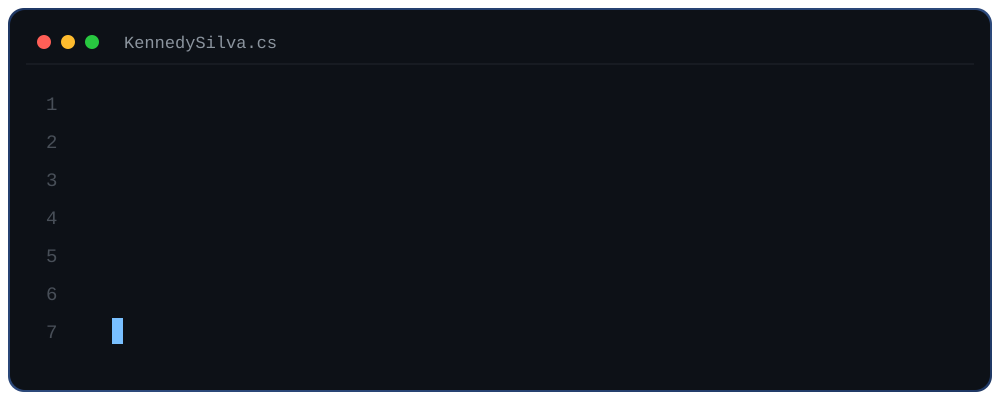

---

## SuperShop &nbsp;·&nbsp; [supershop.pt](https://supershop.pt)

Portuguese e-commerce store in production, with four local payment methods and an admin backoffice.

     

---

## GastroAI &nbsp;·&nbsp; [gastro-ai-pap.vercel.app](https://gastro-ai-pap.vercel.app)

AI cooking assistant with user accounts and Stripe subscriptions. Started as my final school project, graded 20/20 — and kept going.

      

---

## Bus Lisbon &nbsp;·&nbsp; [buslisbon.vercel.app](https://buslisbon.vercel.app)

Live bus tracking for Carris Metropolitana. Arrival alerts over web push, no account needed.

      

---

### Stack

| | |
|---|---|
| **Languages** |          |
| **Frontend** |        |
| **Backend** |        |
| **Data** |      |
| **DevOps & Cloud** |        |
| **Testing** |    |
| **Tools** |      |

Reviewing C# and C++ projects since 2024. Studying Software Development at ISTEC Lisboa.

